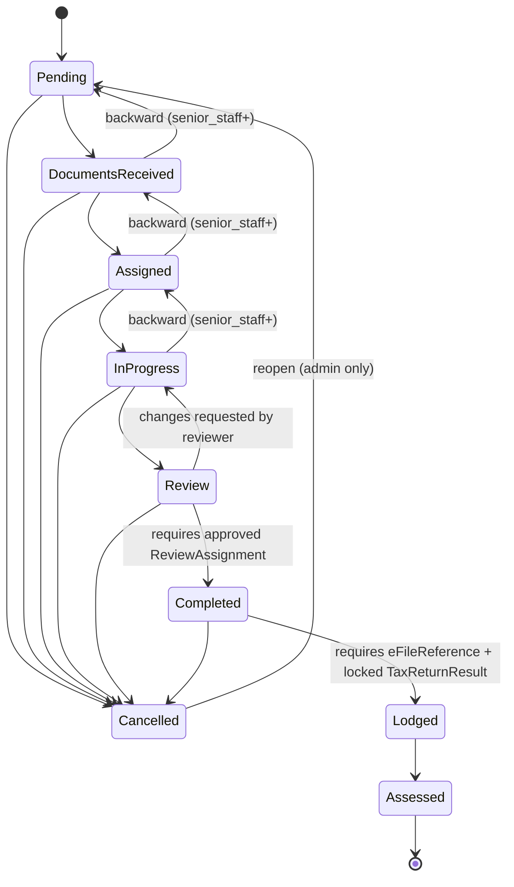
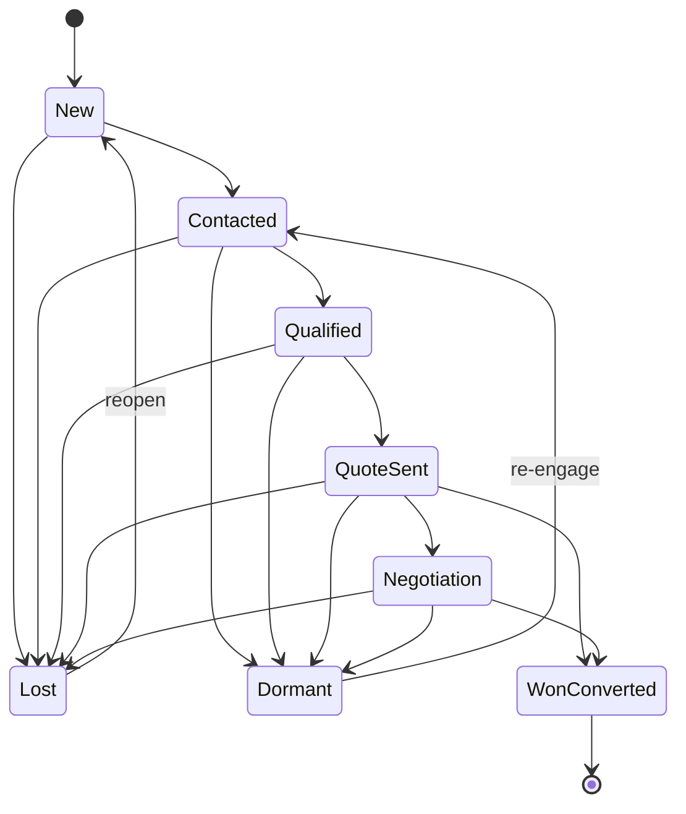
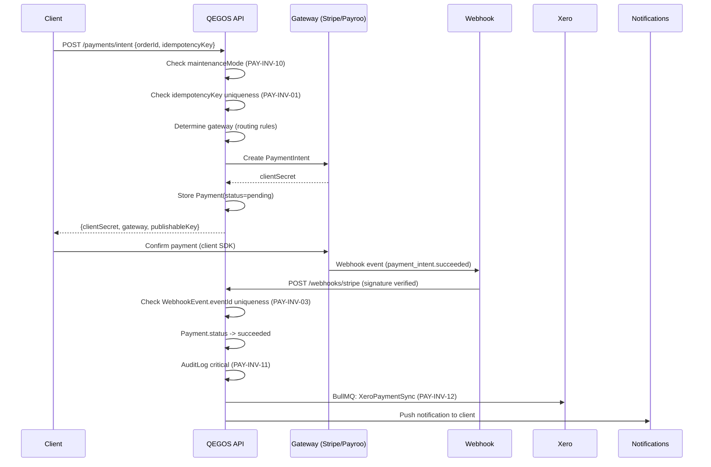
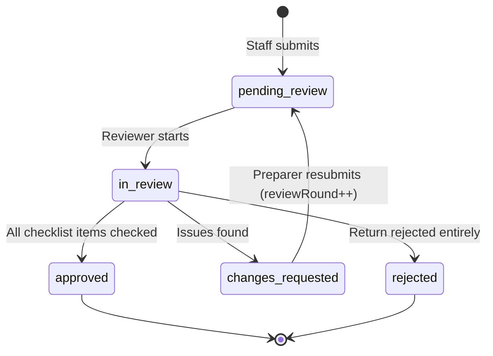
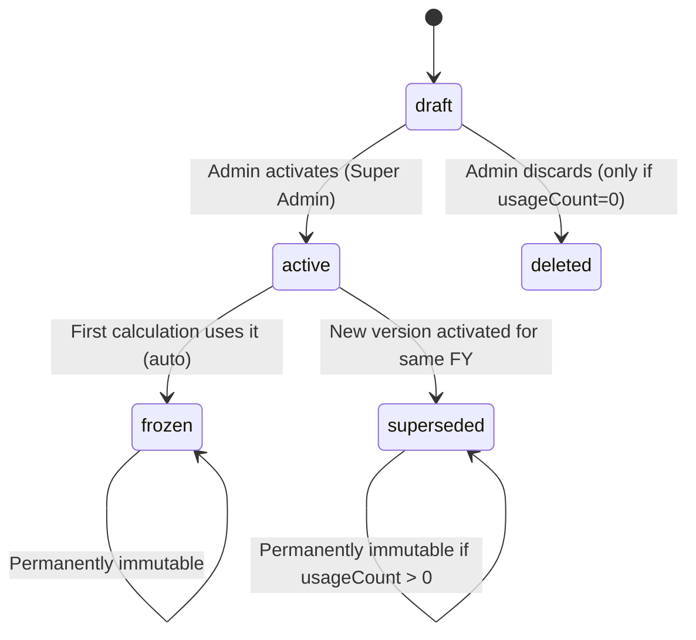
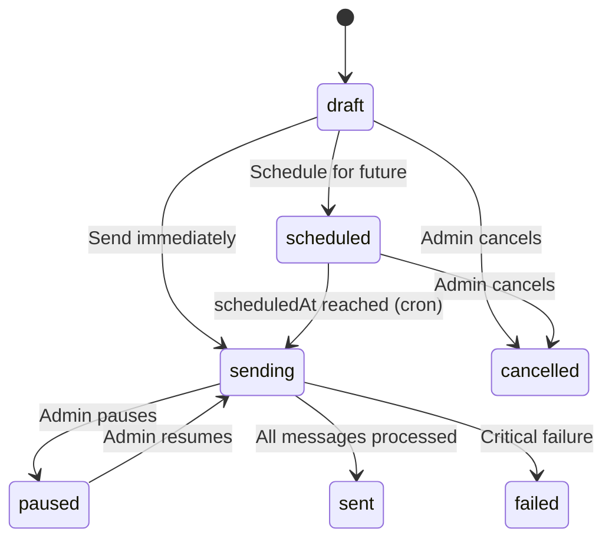
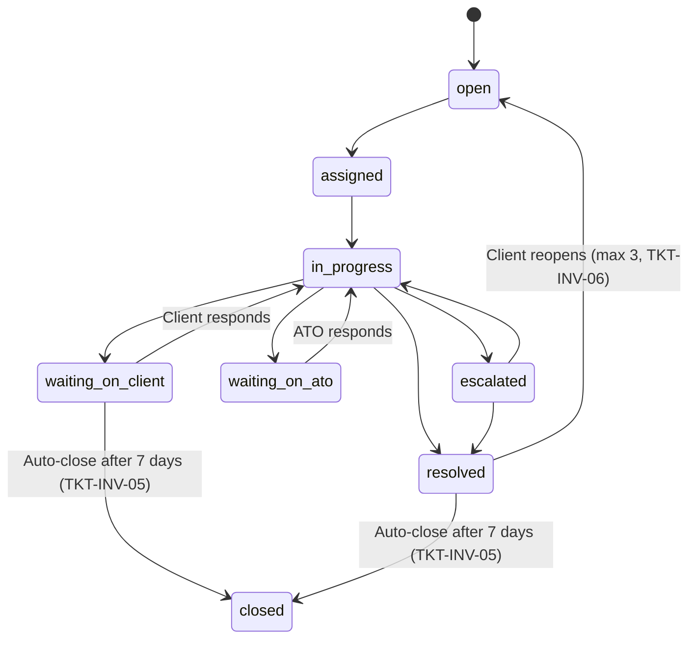

# QEGOS Workflow Documentation

**Product:** QEGOS — Tax Preparation, Filing & Client Management Platform
**Market:** Australia
**Date:** 2026-04-07
**Source:** QEGOS Final Production PRD v4.0

---

## 1. Order Lifecycle (9 States)

### State Machine



### State Definitions

| Code | Label | Colour | Description |
|------|-------|--------|-------------|
| 1 | Pending | Blue | Order created, awaiting document collection |
| 2 | Documents Received | Orange | Client has uploaded required documents |
| 3 | Assigned | Yellow | Assigned to staff for preparation |
| 4 | In Progress | Purple | Staff actively preparing return |
| 5 | Review | Cyan | Prepared, pending review/client sign-off |
| 6 | Completed | Green | Return finalised and signed |
| 7 | Lodged | Teal | Submitted to ATO |
| 8 | Assessed | Dark Green | ATO has issued Notice of Assessment (terminal) |
| 9 | Cancelled | Red | Order cancelled |

### Transition Rules

| Transition | Authorization | Side Effects | Invariants |
|-----------|---------------|-------------|------------|
| Any forward | Authorized user with correct role | AuditLog, status notification | ORD-INV-01 |
| Any backward (e.g., 4->3) | senior_staff or admin | AuditLog | ORD-INV-01 |
| Any -> Cancelled (9) | admin or office_manager | AuditLog critical, void Xero invoice, cancel pending payments, reason REQUIRED | ORD-INV-08 |
| Cancelled -> Pending (9->1) | admin only | AuditLog | ORD-INV-01 |
| -> Assigned (3) | Requires processingBy set | Push notification to assigned staff, AuditLog | ORD-INV-07 |
| -> Review (5) | Staff submits for review | Creates ReviewAssignment, auto-assigns reviewer, push to reviewer | RVW-INV-02 |
| Review -> Completed (5->6) | REQUIRES approved ReviewAssignment | Review request scheduled (24hr delay), Xero invoice finalisation, staff counter++ | RVW-INV-01, ORD-INV-10 |
| -> Lodged (7) | Requires eFileReference OR manual confirmation AND locked TaxReturnResult | AuditLog | RVW-INV-07 |

### Event Emissions

| Status Change | Event | Subscribers |
|---------------|-------|-----------|
| -> In Progress (4) | `order.invoiceable` | XeroSyncWorker (create invoice) |
| -> Completed (6) | `order.completed` | ReviewRequestScheduler (24hr delay), XeroInvoiceFinaliser, StaffCompletionCounter |
| -> Cancelled (9) | `order.cancelled` | XeroInvoiceVoider, PaymentCanceller |

---

## 2. Lead Lifecycle (8 States)

### State Machine



### State Definitions

| Code | Label | Colour | Allowed Next |
|------|-------|--------|-------------|
| 1 | New | Blue | Contacted (2), Lost (7) |
| 2 | Contacted | Orange | Qualified (3), Lost (7), Dormant (8) |
| 3 | Qualified | Yellow | Quote Sent (4), Lost (7), Dormant (8) |
| 4 | Quote Sent | Purple | Negotiation (5), Won (6), Lost (7), Dormant (8) |
| 5 | Negotiation | Cyan | Won (6), Lost (7), Dormant (8) |
| 6 | Won/Converted | Green | Terminal |
| 7 | Lost | Red | New (1) via reopen |
| 8 | Dormant | Grey | Contacted (2) via re-engage |

### Transition Rules

| Transition | Constraint | Side Effect |
|-----------|-----------|-------------|
| Any -> Lost (7) | `lostReason` REQUIRED (LM-INV-03) | System-generated activity log |
| -> Won (6) | Atomic transaction (LM-INV-04): isConverted=true + create User + create Order | Cannot convert twice (LM-INV-05) |
| Lost -> New (1) | Reopen by staff+ | Score recalculated |
| Dormant -> Contacted (2) | Re-engage | Score recalculated |

### Automation Rules (BullMQ Cron)

| Rule | Trigger | Action |
|------|---------|--------|
| Auto-assign | New lead, no assignedTo | Round-robin (skip inactive, skip at-max-capacity 50) (LM-INV-07) |
| Stale alert | New lead > 24hr no activity | Push + Slack to assignee and admin |
| Auto-dormant | Contacted + 14 days no activity | Status -> Dormant, system activity log |
| Follow-up escalation | Reminder overdue > 2 hours | Slack alert to admin |
| Re-engagement flag | Dormant > 30 days | Tag "re-engagement" for broadcast |
| Duplicate detection | New lead | Flag on mobile OR email match (non-blocking) (LM-INV-01) |
| Score recalculation | Any activity, status change, profile update | Recalculate 0-100, update priority if threshold crossed (LM-INV-11) |
| Overdue marker | Reminder past due | isOverdue=true, push notification |

### Lead Scoring (0-100)

| Factor | Points | Condition |
|--------|--------|-----------|
| Has email | +5 | Email provided |
| Complete profile | +10 | All tax fields filled |
| Rental property | +15 | hasRentalProperty = true |
| Share portfolio | +10 | hasSharePortfolio = true |
| Self-employed / contractor | +15 | employmentType match |
| Multiple services | +10 | serviceInterest.length >= 2 |
| Has spouse | +10 | hasSpouse = true |
| Has dependants | +5 | numberOfDependants > 0 |
| Responded positively | +15 | Activity outcome = interested |
| Requested quote | +10 | Quote activity exists |
| Referral source | +10 | source = referral |
| Repeat client | +15 | source = repeat_client |
| Recent contact | +5 | lastContactedAt within 72 hours |
| Foreign income | +10 | hasForeignIncome = true |
| Overdue follow-ups | -10 | Has overdue reminders |
| Multiple no-answer | -10 | 3+ no_answer outcomes |
| Gone cold | -5 | No activity in 7 days |

**Priority thresholds:** 0-30 = cold, 31-60 = warm, 61-100 = hot

---

## 3. Payment Flow

### Intent-to-Capture Flow



### Payment Status Machine

```
pending -> requires_capture -> authorised -> captured -> succeeded
                                                            |
                                                            +-> refund_pending -> refunded
                                                            +-> refund_pending -> partially_refunded
                                                            +-> disputed

Any pre-succeeded state -> failed
Any pre-succeeded state -> cancelled
```

**Strictly one-directional (PAY-INV-07).** No reversals except: refund from succeeded, failed from any pre-succeeded.

### Gateway Fallback Logic (PAY-INV-08)

```
Client requests payment
  |
  v
Try primary gateway
  |
  +-- Success --> continue normally
  |
  +-- ETIMEDOUT / ECONNREFUSED / 5xx --> isRetryable=true
  |     |
  |     v
  |   Try secondary gateway
  |     AuditLog: "Gateway fallback: {primary}->{secondary}, reason: {error}"
  |
  +-- card_declined / insufficient_funds / expired_card --> isRetryable=false
        |
        v
      Return error to client (NO fallback)
```

### Refund Flow

```
Admin: POST /payments/refund {paymentId, amount?, reason, idempotencyKey}
  |
  v
Validation:
  - sum(existing refunds) + newAmount <= capturedAmount (PAY-INV-06)
  - amount > $500 (50000 cents) -> admin approval required (BIL-INV-04)
  - amount > $2,000 (200000 cents) -> super_admin approval required
  |
  v
Call gateway.refund(amount)
  |
  v
Payment.refundedAmount += amount
Payment.status = partially_refunded or refunded
Refund entry added to Payment.refunds[]
  |
  v
BullMQ: create Xero credit note
Push notification: "Refund of $X processed"
AuditLog: severity=critical
```

### Duplicate Payment Detection (BIL-INV-06)

```
Post-payment BullMQ check:
  - 2 payments same orderId within 5 min = auto-flag for review
  - Do NOT auto-refund (requires human review)
```

---

## 4. Review / Approval Pipeline

### State Machine



### States

| State | Description | Who Acts | Next States |
|-------|-------------|----------|-------------|
| pending_review | Submitted, awaiting reviewer | System (assignment) | in_review |
| in_review | Reviewer actively checking | Reviewer | approved, changes_requested, rejected |
| changes_requested | Sent back to preparer | Preparer | pending_review (resubmit) |
| approved | All checks pass | System | Terminal (unlocks lodgement) |
| rejected | Return rejected entirely | Admin/Reviewer | Terminal |

### Assignment Rules

1. **Self-review block:** preparerId !== reviewerId (always enforced)
2. **Seniority gate:** Junior staff (< 1 year) -> must be reviewed by senior_staff or admin
3. **Complexity gate:** > 3 line items OR rental/CGT/foreign income -> senior_staff or admin
4. **Manager review:** Value > $500 OR VIP client -> office_manager
5. **Round-robin:** Default among senior_staff and admin

### Escalation

- reviewRound > 3 -> auto-escalate to admin with flag: "Return requires excessive revisions" (RVW-INV-05)

### Invariants

- Cannot approve with unchecked items (RVW-INV-03)
- Approval creates AuditLog with preparerId, reviewerId, reviewRound, timeToReview (RVW-INV-04)
- Order CANNOT go from Review (5) to Completed (6) without approved ReviewAssignment (RVW-INV-01)
- Lodgement requires BOTH approved ReviewAssignment AND locked TaxReturnResult (RVW-INV-07)

---

## 5. Tax Calculation Flow

### Estimate Flow

```
Input (client or staff)
  |
  v
Load taxRuleConfig:
  - If snapshotId specified: load exact frozen rules
  - If financialYear only: load status=active for that FY
  |
  v
calculateTaxEstimate(input, rules) -- PURE FUNCTION (TAX-INV-02)
  |
  v
Steps (all in integer cents, TAX-INV-03):
  1. Gross Income = sum(all income sources)
     - CGT: shortTerm + (longTerm x (1 - cgtDiscount))
     - CGT discount: residents only, assets held >12mo (TAX-INV-08)
     - Negative gearing: rental loss included
  2. Total Deductions (capped: donations <= taxableIncome)
  3. Taxable Income = max(0, gross - deductions)
  4. Base Tax from bracket table (by residencyStatus)
  5. Medicare Levy (residents only, TAX-INV-06)
  6. Medicare Levy Surcharge (no PHI above threshold)
  7. LITO (residents only)
  8. SAPTO (eligible seniors)
  9. HECS-HELP (additional, not in tax payable, TAX-INV-07)
  10. Total Tax Payable = max(0, base + ML + MLS - LITO - SAPTO - franking) (TAX-INV-04)
  11. Refund/Owing = taxWithheld - (totalTax + HECS)
  12. Effective & Marginal rates
  13. ALWAYS include: disclaimer, rulesSnapshotId, rulesVersion, calculatedAt, warnings (TAX-INV-05)
  |
  v
Store in taxEstimateLog (TAX-INV-09)
Increment usageCount on rules (auto-freeze if first use, VER-INV-01)
  |
  v
Return full breakdown to caller
```

### Official Result Import Flow

```
Staff prepares return in external software (Xero Tax, LodgeiT, MYOB Tax, HandiTax)
  |
  v
POST /api/v1/tax-results {orderId, source, income{}, deductions{}, ...}
  |
  v
System auto-populates TaxYearSummary (VER-INV-14)
  Estimates NEVER write to TaxYearSummary
  |
  v
POST /api/v1/tax-results/:orderId/verify (senior staff)
  |
  v
PATCH /api/v1/tax-results/:id/lock
  -> isLocked=true
  -> All financial figures immutable (VER-INV-06)
  -> Only ATO status fields remain editable
  -> AuditLog: severity=critical (VER-INV-13)
```

### Amendment Flow

```
Client discovers error in prior-year return
  |
  v
Staff creates Amendment Order:
  - orderType: "amendment"
  - linkedOrderId: original order
  - financialYear: SAME as original (not current FY)
  |
  v
System loads ORIGINAL return's rulesSnapshotId (VER-INV-05)
  - NOT the currently active rules
  - Guarantees correct FY brackets even years later
  |
  v
Staff prepares amended return in external software
  |
  v
POST /api/v1/tax-results/amendment
  - System auto-calculates diff (amendmentChanges) (VER-INV-12)
  - Links to original via originalReturnId
  - amendmentNumber incremented
  |
  v
Lodge amendment with ATO -> atoAmendmentRef recorded -> isLocked=true
  |
  v
ATO processes -> atoAmendmentStatus updated
```

---

## 6. Tax Rule Versioning Lifecycle

### State Machine



### Transitions

| From | To | Trigger | Effect |
|------|----|---------|--------|
| draft | active | Super Admin activates | Previous active -> superseded. Test suite MUST pass. AuditLog critical. |
| draft | deleted | Admin discards | Only if usageCount === 0. Hard delete allowed. (VER-INV-10) |
| active | frozen | First calculation uses it | Auto-transition. usageCount incremented atomically ($inc). (VER-INV-03) |
| active | superseded | New version activated | Old active -> superseded. Still accessible by snapshotId. |
| frozen | (none) | Cannot transition | Permanently immutable. |
| superseded | (none) | Cannot transition | Permanently immutable if usageCount > 0. |

### Correction Flow (Not Editing)

```
Discover error in frozen/superseded rules (e.g., wrong HECS tier)
  |
  v
POST /api/v1/tax/rules/:id/correct {corrections, changeReason}
  |
  v
System creates NEW version:
  - New snapshotId (UUID v4, never reused, VER-INV-11)
  - parentSnapshotId points to corrected version
  - changeReason REQUIRED (VER-INV-07)
  |
  v
Original stays FROZEN -- existing calculations unchanged (VER-INV-01)
New calculations use corrected version
```

### Reproducibility Guarantee

Given any TaxReturnResult or TaxEstimateLog, the system reproduces EXACT output by:
1. Read stored `rulesSnapshotId`
2. Load FROZEN taxRuleConfig for that snapshot
3. Read stored input
4. Run `calculateTaxEstimate(input, rules)`
5. Get IDENTICAL output (integer arithmetic is deterministic)

---

## 7. Broadcast Campaign Lifecycle

### State Machine



### States

| State | Editable | Description |
|-------|:--------:|-------------|
| draft | Yes | Being composed |
| scheduled | No (BRC-INV-05) | Waiting for scheduledAt |
| sending | No | Messages being dispatched |
| paused | Yes | Admin-paused mid-send |
| sent | No | All messages processed |
| failed | No | Critical failure |
| cancelled | No | Admin cancelled |

### Sending Engine (BullMQ)

| Channel | Batch Size | Rate | Queue Schedule |
|---------|-----------|------|---------------|
| SMS (Twilio) | 2500/run | 10 msg/sec | Every 5 min |
| Email (SES) | 500/run | 100 msg/sec | Every 5 min |
| WhatsApp (Meta) | 500/run | 80 msg/sec | Every 5 min |

### Spam Act 2003 Compliance Checks (per message)

```
For each recipient at SEND time (not schedule time):
  1. Check DND/opt-out list (BRC-INV-01)
  2. Check ConsentRecord for channel (BRC-INV-07)
  3. No consent = skip
  4. SMS: auto-append "Reply STOP to unsubscribe" (BRC-INV-02)
  5. Email: auto-append sender ID (business name + ABN) + unsubscribe link (BRC-INV-03)
  6. Resolve merge tags with fallbacks (BRC-INV-08)
```

### Bounce/Complaint Handling

| Event | Action |
|-------|--------|
| Hard bounce (550) | Immediate DND for email (BRC-INV-04) |
| 3x soft bounce same address | Add to DND |
| Spam complaint | Immediate DND for ALL channels (BRC-INV-04) |
| STOP keyword (SMS) | Auto-add to DND |

---

## 8. Support Ticket Lifecycle

### State Machine



### SLA Configuration

| Priority | First Response | Resolution Target | Escalation Trigger |
|----------|---------------|-------------------|-------------------|
| Urgent | 1 hour | 4 hours | Auto-escalate if unassigned > 30 min |
| High | 4 hours | 8 business hours | Auto-escalate if no update > 4 hours |
| Normal | 8 hours | 24 business hours | Flag if no update > 12 hours |
| Low | 24 hours | 48 business hours | Flag if no update > 24 hours |

**Business hours:** Mon-Fri 9am-5pm AEST. Tax season (Jul-Oct): Mon-Sat 8am-8pm.

### Auto-Escalation Rules (BullMQ cron every 5 min)

| Rule | Trigger | Action |
|------|---------|--------|
| Unassigned urgent | Urgent + unassigned > 30 min | Auto-assign on-duty admin + Slack |
| SLA imminent | 80% elapsed, still open | Push to assignee + Slack warning |
| SLA breached | Deadline passed | slaBreached=true, Slack admin, escalate to office_manager |
| Client waiting | waiting_on_client > 7 days | Auto-close with system message |
| Repeat complainant | 3+ tickets in 30 days | Flag client profile, alert admin |
| Staff complaint | category=staff_complaint | Auto-assign office_manager (NEVER to complained-about staff, TKT-INV-02) |
| First response breach | First response SLA elapsed | firstResponseBreached=true, escalate |

### Integration Points

| From -> To | Mechanism |
|------------|-----------|
| Chat -> Ticket | "Convert to Ticket" button |
| WhatsApp -> Ticket | "Create Ticket" on inbound message |
| Order -> Ticket | "Report an Issue" on order detail |
| Ticket satisfaction -> Reviews | Low satisfaction (1-2) flagged |
| Ticket volume -> Analytics | Feeds executive dashboard |

---

## 9. Referral Lifecycle

### State Machine

```
pending -> signed_up -> order_created -> completed -> rewarded
    |
    +-> expired (12 months)
```

### States

| State | Description | Trigger |
|-------|-------------|---------|
| pending | Referral code shared, referee not yet signed up | Code shared |
| signed_up | Referee created account | Referee signup with code |
| order_created | Referee created an order | Order created |
| completed | Referee's order completed with payment | Order status >= 6 AND payment succeeded |
| rewarded | Both parties received rewards | System processes reward |
| expired | Code expired (12 months) | Cron check |

### Reward Trigger (REF-INV-01)

ALL three conditions must be true:
1. Referee's order status >= Completed (6)
2. At least one payment status = succeeded
3. Order.finalAmount >= config.minimumOrderValueForReward

### Guards

- Self-referral prevention: referrer mobile AND email !== referee (REF-INV-02)
- One-time referral: unique constraint on refereeId (REF-INV-03)
- Max per client per year: configurable (default 50) (REF-INV-07)
- Credit balance rewards expire after 12 months (REF-INV-04)
- Codes case-insensitive, stored uppercase (REF-INV-05)

---

## 10. Document Signing Workflow

### Zoho Sign / DocuSign Flow

```
Staff prepares document for signing
  |
  v
POST /api/v1/documents/create
  -> Upload to Zoho Sign
  |
  v
POST /api/v1/documents/send-for-sign
  -> Send to client via Zoho Sign/DocuSign
  |
  v
Client receives notification
  |
  v
POST /api/v1/documents/generate-uri
  -> Embedded signing URL for in-app signing
  |
  v
Client signs
  |
  v
POST /api/v1/webhooks/zoho (signature verified)
  -> Receives signed PDF
  -> SIGN_COMPLETE event emitted
  -> Document status: pending -> signed
  -> Signed PDF stored in order documents
```

---

## 11. Xero Sync Workflows

### 11.1 Contact Sync

```
Trigger: Lead converted to user, or new order for unsynced user
  |
  v
Check: User has Xero Contact? (match by email primary, then mobile) (XRO-INV-06)
  +-- Yes -> skip
  +-- No -> create from User (name, email, mobile, address)
  |
  v
POST to Xero Contacts API
  -> Store xeroContactId on User
  -> XeroSyncLog: status=success
```

### 11.2 Invoice Sync (Auto)

```
Trigger: Order status -> In Progress (4) or order created with line items
  Event: "order.invoiceable"
  |
  v
BullMQ: XeroSyncWorker picks up job
  |
  v
1. Check xeroConnected (XRO-INV-10)
   +-- No -> queue with status=queued, retry when reconnected
  |
  v
2. Check Order.xeroInvoiceId exists (XRO-INV-04)
   +-- Yes -> skip (idempotent)
  |
  v
3. Search Xero by reference (orderNumber) for duplicates (XRO-INV-04)
   +-- Found -> skip, log warning
  |
  v
4. Ensure Xero Contact exists for user
  |
  v
5. Build invoice:
   - Line items from Order.lineItems using priceAtCreation (XRO-INV-07)
   - GST: Math.round(priceInCents / 11) per line item (BIL-INV-01)
   - Student discount if applicable
  |
  v
6. POST invoice to Xero (status = AUTHORISED)
   Rate limited: max 60/min (XRO-INV-03)
  |
  v
7. Store xeroInvoiceId + xeroInvoiceNumber on Order
8. XeroSyncLog: status=success
```

### 11.3 Payment Sync (Auto)

```
Trigger: Payment.status -> succeeded
  Event: "payment.succeeded"
  |
  v
BullMQ: XeroPaymentSync
  |
  v
1. Find Order.xeroInvoiceId
   +-- Not yet -> wait and retry (invoice might be in flight)
  |
  v
2. Create Xero Payment against invoice, reference: paymentNumber
  |
  v
3. If overpayment: create Xero Prepayment
  |
  v
4. Store xeroPaymentId on Payment record
5. XeroSyncLog: status=success
```

### 11.4 Credit Note (Refund)

```
Trigger: "payment.refunded" or "payment.partially_refunded"
  |
  v
BullMQ: XeroCreditNoteSync
  |
  v
1. Create Xero Credit Note against invoice for refund amount
2. Allocate credit note to invoice
3. XeroSyncLog: status=success
```

### 11.5 Invoice Adjustment (Post-Sync)

```
Order line items changed after Xero invoice synced
  |
  v
POST /api/v1/orders/:id/adjust-invoice (admin+)
  |
  v
TWO-STEP ATOMIC (BIL-INV-02):
  1. Void existing AUTHORISED invoice (never modify in place)
  2. Create new invoice with corrected amounts
  3. If already paid: credit note for difference
  |
  v
AuditLog: severity=critical
```

### 11.6 Retry & Failure Handling

```
Sync attempt fails
  |
  v
Exponential backoff (XRO-INV-05):
  Attempt 1: retry after 1 min
  Attempt 2: retry after 5 min
  Attempt 3: retry after 30 min
  Attempt 4: retry after 2 hr
  |
  v
After 4 failures:
  - XeroSyncLog.status = failed
  - Slack alert to admin
  - Manual retry available: POST /api/v1/xero/retry/:syncLogId
```

### 11.7 Token Refresh

```
Any Xero API call
  |
  v
Check xeroTokenExpiresAt
  +-- Not expired -> proceed
  +-- Expired -> acquire Redis distributed lock (Redlock, 5s TTL) (XRO-INV-02)
       +-- Lock acquired -> refresh token, store encrypted (XRO-INV-01)
       +-- Lock held by another -> wait, use refreshed token
```

---

## 12. WhatsApp Conversation Window Management

### Template vs Freeform

```
Outbound message request
  |
  v
Is contact within 24hr conversation window?
  (conversationWindowExpiresAt = lastInboundAt + 24hr)
  |
  +-- Yes -> freeform text allowed
  |
  +-- No -> MUST use pre-approved template (WHA-INV-02)
        Return 400 if freeform attempted:
        {code: "WINDOW_EXPIRED", message: "Use a template message."}
```

### Inbound Message Processing

```
Meta webhook: POST /api/v1/webhooks/whatsapp
  |
  v
GET request: verification challenge (return hub.challenge) (WHA-INV-08)
POST request: X-Hub-Signature-256 verification
  |
  v
Parse message
  |
  v
1. Match contact (Lead or User) by phone number
   Phone format: stored +61XXXXXXXXX, Meta API uses 61XXXXXXXXX (WHA-INV-04)
  |
  v
2. Set conversationWindowExpiresAt = now + 24hr (WHA-INV-03)
  |
  v
3. If media (image, PDF, etc.):
   - BullMQ: download from Meta CDN within 30 min (WHA-INV-01)
   - Store to S3
   - Offer one-click save to vault (WHA-INV-06)
  |
  v
4. Auto-create LeadActivity (if lead) type=whatsapp_received (WHA-INV-05)
  |
  v
5. Check DND before any outbound reply (WHA-INV-07)
```

---

## 13. Prorated Cancellation Workflow

```
Client requests order cancellation (partially completed)
  |
  v
Staff reviews each line item:
  - completed -> full charge
  - in_progress -> staff enters prorated amount (cents)
  - not_started -> $0
  - cancelled -> $0
  |
  v
System recalculates finalAmount
  |
  v
If already paid:
  - Calculate difference
  - Process refund for overpayment
  |
  v
Xero: void old invoice, create adjusted invoice
  + credit note for difference (BIL-INV-02)
  |
  v
Order status -> Cancelled (9)
AuditLog: severity=critical
```

---

## 14. Billing Dispute Workflow

```
Client raises billing dispute (via ticket or directly)
  |
  v
BillingDispute created:
  {ticketId, orderId, paymentId, disputeType, disputedAmount, clientStatement}
  Status: raised
  AuditLog: severity=critical (BIL-INV-07)
  |
  v
Staff investigates:
  Status: investigating
  staffAssessment filled
  |
  v
Resolution proposed:
  Status: pending_approval
  resolution: full_refund | partial_refund | credit_issued | no_action | service_redo | discount_applied
  |
  v
Admin approves:
  Status: approved -> completed
  resolvedAmount processed
  Xero adjustment if needed
```

---

## 15. Write-Off / Bad Debt Workflow

```
Invoice outstanding > 90 days
  |
  v
Verify: 2+ documented contact attempts
  |
  v
Admin approval required (BIL-INV-05)
  |
  v
POST /api/v1/payments/write-off
  |
  v
Void Xero invoice + create bad debt entry
AuditLog: severity=critical
```

---

## 16. Notification Engine (Cross-Module)

### Sending Flow

```
Any module calls NotificationService.send(notification)
  |
  v
1. Check NotificationPreference for recipient (NTF-INV-01)
   User opted out of SMS -> no SMS regardless of module request
  |
  v
2. Check quiet hours (NTF-INV-02)
   Push/SMS during quiet hours -> queue delayed job (BullMQ)
   Email and in-app: not subject to quiet hours
  |
  v
3. Deduplication check (NTF-INV-03):
   Same type + recipientId + relatedResourceId within 5 min = skip
  |
  v
4. Resolve merge tags with fallbacks (NTF-INV-04)
  |
  v
5. Send per channel:
   - push: FCM (clean stale tokens on error, NTF-INV-03)
   - sms: Twilio
   - email: Gmail SMTP (transactional) or SES (campaign)
   - in_app: store in Notification collection
   - slack: webhook
  |
  v
6. Record channelResults per channel
```

---

## Cross-Module Integration Matrix

| From | To | Trigger | Mechanism |
|------|----|---------|-----------|
| Broadcast | Lead Mgmt | Campaign-sourced lead | Lead.source=marketing_campaign, Lead.campaignId |
| Lead Mgmt | Users | Conversion | MongoDB transaction |
| Lead Mgmt | Orders | Conversion | Order.leadId, prefill from lead |
| Orders | Tax Engine | Estimate linked | POST /tax/estimate with orderId |
| Orders | Review Pipeline | Submit for review | ReviewAssignment on status -> 5 |
| Orders | Xero | Auto-invoice | BullMQ: "order.invoiceable" |
| Tax Results | Tax Year Summary | Official results | Post-save hook sync |
| Tax Results | Amendments | Amendment uses original's snapshot | Auto-load rulesSnapshotId |
| Payments | Xero | Payment sync | BullMQ: "payment.succeeded" |
| Payments | Billing Disputes | Disputed payment | billingDispute.paymentId |
| Refunds | Xero | Credit note | BullMQ: "payment.refunded" |
| Orders | Reviews | Auto-request 24hr delay | BullMQ: "order.completed" |
| Reviews | Google | ALL reviews -> prompt | Non-conditional deep link |
| Referral | Lead Mgmt | Code -> new lead | Lead.source=referral |
| Referral | Orders | Discount on conversion | Order.discountAmount |
| WhatsApp | Lead Activity | Auto-log | Webhook -> LeadActivity |
| WhatsApp | Vault | Media save | One-click: media -> S3 -> vaultDocument |
| WhatsApp | Broadcast | Third channel | broadcast.channel includes whatsapp |
| Calendar | Notifications | Deadline reminders | Cron -> NotificationService |
| Vault | Orders | Prior-year prefill | GET /vault/prefill/:financialYear |
| Chat | Lead Activity | Messages logged | Auto-create LeadActivity |
| Chat | Tickets | Convert | "Convert to Ticket" button |
| Tickets | Analytics | Support metrics | Volume, SLA in dashboard |
| All | Audit Log | Every mutation | Mongoose post-save middleware |
| All | Analytics | Unified aggregation | Read replica aggregation |
| All | Notifications | Centralised send | NotificationService.send() |
| RBAC | Permission Audit | Role changes | permissionSnapshot on change |
| Tax Rules | Audit Log | Rule changes | Activation/correction/lock = critical |
